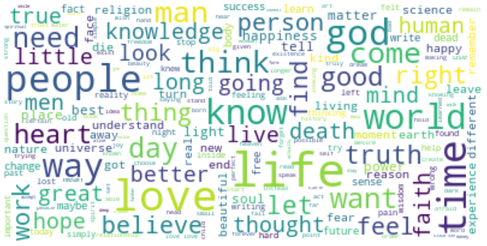

<html>

# MVP (Define Quotes Tags Using Natural language processing): 
by(Shaikha Bin Ateeq & Raghad Althunayan )

# Goal of the project:
The core objective is to predict the quote tags, and develop a topic modeling to predict the correct tag of quote that can correctly classify the topic.

# Exploratory data analysis:

After performing the initial EDA which included:
<ul>
<li> Checked for nulls values.</li>
<li>Checked for duplicates and remove.</li>

</ul>

Natrual Langauge Processing:
<ul>
<li>Remove extra spaces and punctuations</li>
<li>remove repeated characters in words</li>
<li>Remove numbers</li>
<li>Removing the top 5 frequent words</li>
<li>Remove Non English worlds</li>
<li>Removing rare words</li>
<li>Remove Stop Word.</li>
<li>Vectorization.</li>
<li>Tokenization.</li>
<li>Stemming.</li>

</ul>

The above figure shows the most frequents words

</html>
